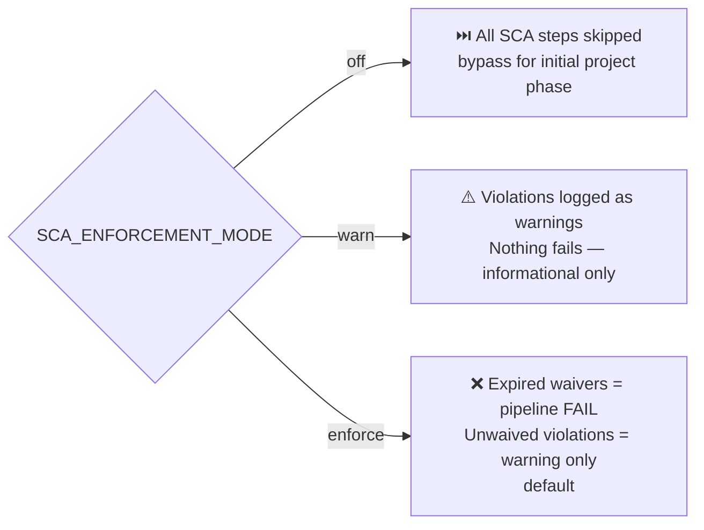
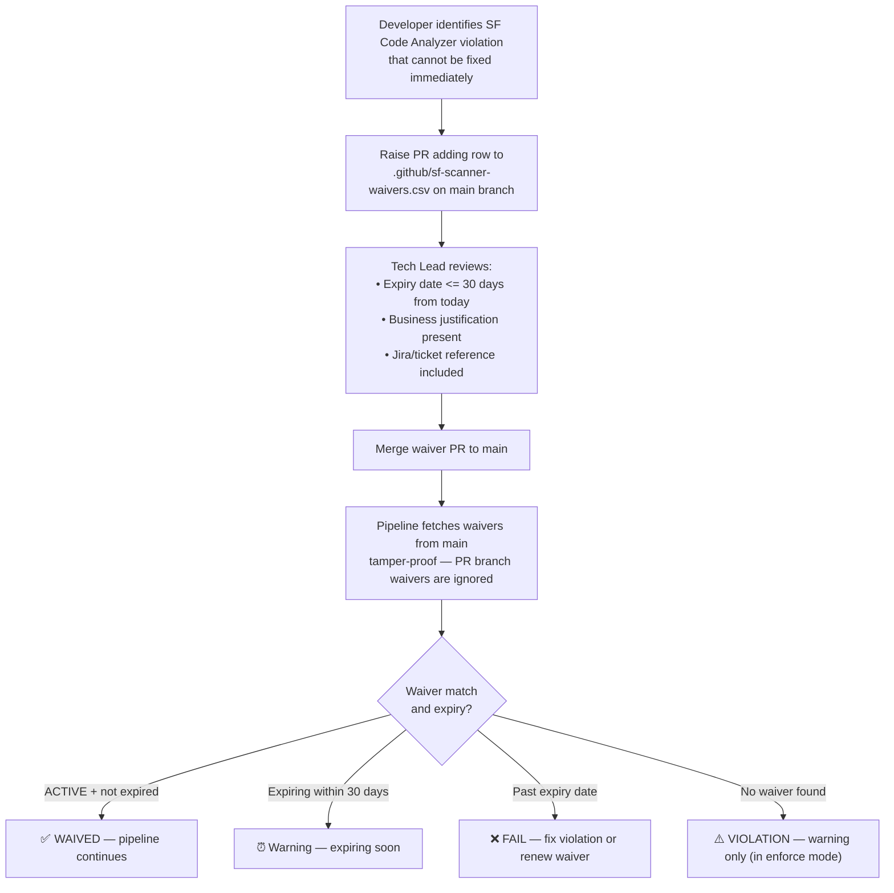
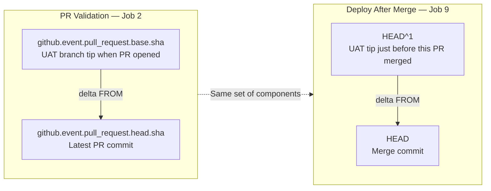

# UAT End-to-End Pipeline — Flow Diagram

## Overview

The `UAT End-to-End Pipeline` automates the full lifecycle of a Salesforce change from PR creation through security scanning, approval, deployment to UAT, and robotic test execution.

### Triggers

| Event | What it does |
|-------|-------------|
| `pull_request` → `uat` | Runs validation + security scans + reviewer notification |
| `pull_request_review` (approved) | Merges PR + deploys + triggers CRT tests |
| `workflow_dispatch` (deploy) | Manual security scan trigger |
| `workflow_dispatch` (rollback) | Reverts last deployment |

---

## Full Pipeline Flow

```mermaid
flowchart TD
    START([🚀 PR opened / pushed to UAT branch]) --> SETUP

    subgraph JOB1["JOB 1 — Evaluate Scanner Availability"]
        SETUP["⚙️ setup\nCheck if CX_CLIENT_SECRET / FOD_CLIENT_SECRET exist\nOutput: run-checkmarx, run-fortify flags"]
    end

    SETUP --> PARALLEL_START

    PARALLEL_START((" ")) --> SF_VAL
    PARALLEL_START --> SCA_SAST
    PARALLEL_START --> CX
    PARALLEL_START --> FORTIFY

    subgraph JOB2["JOB 2 — Salesforce PR Validation"]
        SF_VAL["🔵 salesforce-validation
        1. Request reviewers: ss10del, chorevathi-deloitte
        2. Checkout + install SF CLI
        3. Authenticate UAT org
        4. Extract test classes from PR description
        5. Build delta (sfdx-git-delta: base → head)
        6. Validate deploy to UAT org (check-only + async polling)
        7. Check Apex test coverage >= threshold
        8. Fetch SCA waivers from main branch (tamper-proof)
        9. Run Salesforce Code Analyzer on changed files
        10. Compare violations against waivers (expired = FAIL)
        11. Post SCA governance report as PR comment
        Output: has_delta"]
    end

    subgraph JOB3["JOB 3 — SCA/SAST Stage (npm dependency audit)"]
        SCA_SAST["🟡 sca-sast-stage
        1. Checkout + npm install
        2. npm audit (high/critical vulnerabilities)
        3. Check .github/sca-waivers.json for active waivers
        4. FAIL if unwaived or expired vulnerabilities found"]
    end

    subgraph JOB5["JOB 5 — CheckMarx SAST (if CX secret present)"]
        CX["🔴 checkmarx-sast
        Checkmarx/ast-github-action
        SAST + KICS scan → SARIF
        Upload to GitHub Code Scanning"]
    end

    subgraph JOB6["JOB 6 — Fortify FoD SAST + DAST (if FOD secret present)"]
        FORTIFY["🟠 fortify-sast-dast
        fortify/github-action SAST → SARIF
        Optional DAST scan via fcli if FOD_DAST_SCAN_URL set
        Upload to GitHub Code Scanning"]
    end

    SF_VAL --> HARD_GATES

    subgraph JOB4["JOB 4 — Automated Hard Gates (if has_delta)"]
        HARD_GATES["🟢 automated-governance
        1. Authenticate UAT org
        2. Run ALL Apex tests with coverage
        3. Enforce >= COVERAGE_THRESHOLD% (default 85%)
        4. Check for destructive changes XML
        5. Post PR warning if destructive changes found
        6. Run Salesforce Code Analyzer on changed files"]
    end

    SF_VAL --> FAN_IN
    SCA_SAST --> FAN_IN
    CX --> FAN_IN
    FORTIFY --> FAN_IN
    HARD_GATES --> FAN_IN

    FAN_IN(("All pass?"))
    FAN_IN -->|"❌ Any job failed"| PIPELINE_FAIL(["❌ Pipeline fails\nNo merge or deploy"])
    FAN_IN -->|"✅ All pass"| REVIEW_TRIGGER(["👍 Reviewer approves PR\npull_request_review event"])

    REVIEW_TRIGGER --> MERGE_GATE

    subgraph JOB7["JOB 7 — Approval + Merge Gate"]
        MERGE_GATE["🔒 approval-merge-gate
        1. Verify approval is for latest commit SHA (not stale)
        2. Confirm all required checks passed on this SHA
        3. Merge PR via GitHub API (merge commit)
        Output: merge_commit_sha"]
    end

    MERGE_GATE -->|"✅ Merged"| DEPLOY

    subgraph JOB8["JOB 8 — Deploy After Merge"]
        DEPLOY["🚀 deploy-after-merge
        1. Checkout merge commit
        2. Rebuild delta (HEAD^1 → HEAD)
        3. Deploy to UAT org (async with live status table)
        4. Run specified/inferred Apex tests
        5. Show per-class coverage
        6. Save rollback manifest artifacts
        7. Build deployment package (zip + metadata)
        8. Commit package to pr_packages branch
        9. Auto-update DELTA_FROM_COMMIT variable to deployed SHA"]
    end

    DEPLOY -->|"✅ Deployed"| CRT

    subgraph JOB9["JOB 9 — CRT Smoke Tests"]
        CRT["🤖 trigger-crt-tests
        1. Trigger Copado Robotic Testing job via GraphQL API
        2. Poll build status every 30s until pass/fail/timeout
        3. Print Job Summary box (PR, raiser, approver, build ID, result)
        4. Post deployment comment to PR
        5. Write CRT dashboard link to GitHub Step Summary"]
    end

    ROLLBACK_TRIGGER(["🔧 workflow_dispatch\naction = rollback"]) --> ROLLBACK

    subgraph JOB10["JOB 10 — Rollback"]
        ROLLBACK["🔄 rollback
        1. Validate rollback_commit_sha provided
        2. Build forward delta (what was deployed by the PR)
        3. Build reverse delta (what to deploy to revert)
        4. Deploy reverse delta with pre-destructive changes
        5. RunLocalTests if Apex involved, else NoTestRun
        6. Post rollback status comment to PR"]
    end
```

---

## SCA Enforcement Modes

The `SCA_ENFORCEMENT_MODE` repository variable controls how Code Analyzer violations are handled:

---

## Waiver Governance Flow

---

## Delta Calculation

> This ensures exactly the same components that were validated are deployed — no surprises.

---

## Job Execution Matrix

| # | Job Name | Event Trigger | Depends On | Key Condition |
|---|----------|--------------|------------|---------------|
| 1 | Evaluate Scanner Availability | PR, dispatch | — | Not pull_request_review |
| 2 | Salesforce PR Validation | PR | setup | pull_request event |
| 3 | SCA/SAST Stage | PR, dispatch | setup | pull_request or workflow_dispatch (parallel with Job 2) |
| 4 | Automated Hard Gates | PR | salesforce-validation | pull_request + has_delta=true |
| 5 | CheckMarx AST Scan | PR, dispatch | setup | run-checkmarx=true (CX secret present, parallel) |
| 6 | Fortify FoD Scan | PR, dispatch | setup | run-fortify=true (FOD secret present, parallel) |
| 7 | Approval + Merge Gate | PR review | — | pull_request_review + approved |
| 8 | Deploy After Merge | PR review | approval-merge-gate | merged=true |
| 9 | Trigger CRT Tests | PR review | deploy-after-merge | deploy result=success |
| 10 | Rollback | dispatch | — | action=rollback |

---

## Key Secrets & Variables

| Name | Type | Purpose |
|------|------|---------|
| `CRT_UAT_AUTHURL` | Secret | Salesforce SFDX auth URL for UAT org |
| `GH_PAT` | Secret | Fine-grained PAT to update `DELTA_FROM_COMMIT` variable |
| `CRT_API_TOKEN` | Secret | Copado Robotic Testing API token |
| `CX_CLIENT_SECRET` | Secret | Enables CheckMarx scan (Job 5) |
| `FOD_CLIENT_SECRET` | Secret | Enables Fortify scan (Job 6) |
| `SCA_ENFORCEMENT_MODE` | Variable | `enforce` (default) / `warn` / `off` |
| `DELTA_FROM_COMMIT` | Variable | Fallback baseline SHA for delta calculation |
| `COVERAGE_THRESHOLD` | Variable | Apex coverage minimum % (default: 85) |
| `CRT_JOB_ID` | Variable | CRT job ID to trigger (default: 115686) |
| `CRT_PROJECT_ID` | Variable | CRT project ID (default: 73283) |
| `CRT_ORG_ID` | Variable | CRT org ID (default: 43532) |
